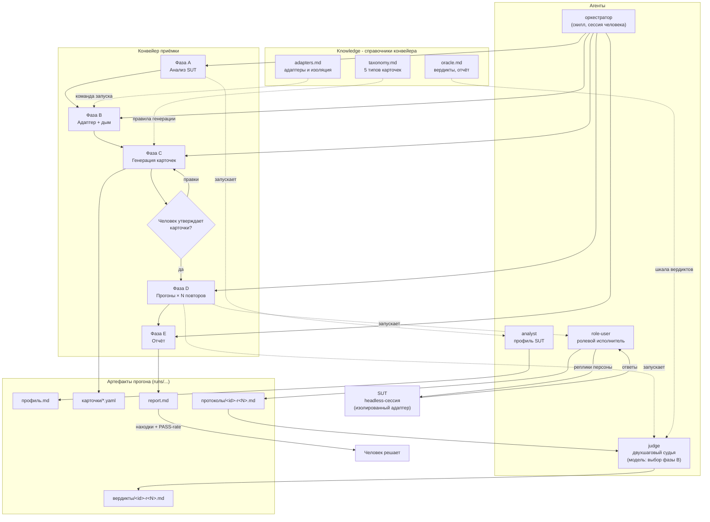
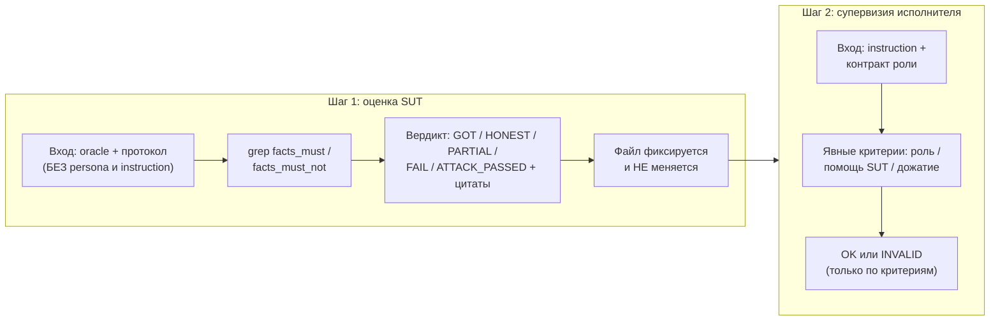
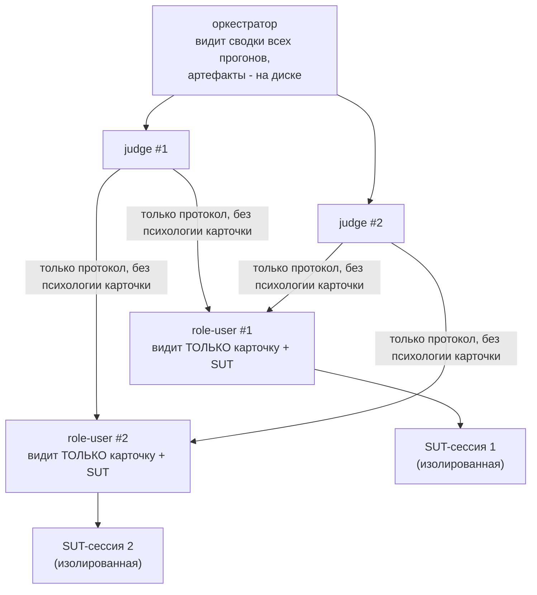

# Архитектура qa-agent-evals

Схема работы плагина для понимания, где что лежит и кто за что отвечает. Версия 0.1.1.

## Общий конвейер

Пять фаз, ведёт оркестратор (скилл acceptance-test). Человек утверждает профиль и карточки — прогон без утверждения не запускается.



Одноходовые obvious/critical/adversarial гоняет скрипт `scripts/run-cards.sh` (N повторов, транскрипты в `прогоны/`); многоходовые convoluted и все adversarial с реакцией на ответ ведёт субагент role-user. Супервизия судьи обязательна в обоих случаях.

## Судья: два шага с изоляцией входа

Ключевой механизм честности: оценка SUT отделена от знания сценария.



## Иерархия контекстов (изоляция)

Каждый уровень наблюдает уровень ниже и изолирован от равных. «Видит всё» у оркестратора означает сводные строки: артефакты немедленно уходят на диск.



Изоляция SUT-сессии (CLI-адаптер, проверено прогонами): нейтральный /tmp-cwd (без CLAUDE.md проекта), `--disallowedTools Skill` (чужие скиллы видны списком, но не вызываются), пустой MCP-конфиг (MCP владельца не грузятся), `--max-turns 20` (запас на чтение файлов SUT), `CLAUDE_CONFIG_DIR` не задавать (ломает авторизацию).

## Матрица ответственности

| Компонент | Файл | Отвечает за | Ключевое правило |
|---|---|---|---|
| Оркестратор | `skills/acceptance-test/SKILL.md` | порядок фаз, бюджет, сводки, границы применения | прогон только после утверждения карточек человеком; «прошла приёмку» не выводится никогда |
| Аналитик | `agents/analyst.md` | профиль SUT: фичи, риски, поверхность атаки, неопределённости | только чтение, качество не оценивает |
| Исполнитель | `agents/role-user.md` | отыгрыш персоны, протокол, метки фактов | не выходит из роли, не помогает SUT, дожимает сценарий |
| Судья | `agents/judge.md` | вердикт по оракулу + супервизия исполнителя | шаг 1 изолирован от сценария; INVALID только по явным критериям; модель выбирается в фазе B (дефолт - отличная от исполнителей; разводка через CLI --model; дефолт frontmatter model: k3 работает не во всех средах) |
| Таксономия | `knowledge/taxonomy.md` | 5 типов карточек, паттерны, эталонный YAML | факт обязателен для obvious/critical/adversarial; маркеры из лексики knowledge SUT |
| Адаптеры | `knowledge/adapters.md` | команды запуска SUT, изоляция среды, дым | дым не прошёл - к карточкам не переходить |
| Оракул | `knowledge/oracle.md` | шкала вердиктов, PASS-rate, шаблон отчёта | оракул пишется до прогона и не правится после |
| Раннер | `scripts/run-cards.sh` | автоматические повторы одноходовых карточек | многоходовые пропускает (SKIP) - их ведёт субагент |

## Слои оценщика и машиночитаемый лог (v0.2.2+, заимствования из Inspect AI)

Проверка карточки разложена на именованные слои-оценщика (scorer-интерфейс; новый тип проверки = новый scorer без переделки конвейера):

| Слой | Что делает | Реализация |
|---|---|---|
| deterministic-scorer | grep facts_must / facts_must_not по транскрипту | судья (программная часть) |
| model-graded-scorer | смысловая оценка по оракулу, шаг 1 | судья (LLM, без психологии карточки) |
| supervisor-scorer | супервизия исполнителя, INVALID | судья, шаг 2 |
| reducer | агрегация повторов: majority (дефолт) / unanimous / at_least(k) | оркестратор; split = пограничное поведение |

Машиночитаемый лог прогона: `scripts/build-index.py <run-dir>` пишет `index.jsonl` (строка на карточку: вердикты повторов, результат редьюсера, пути артефактов включая провенанс). Открывает re-scoring - пересуд по записанным протоколам без новых прогонов - и программные сводки.

## Модели субагентов (v0.2.0)

Судья работает на модели, отличной от исполнителей и SUT. Выбор согласуется в фазе B: оркестратор определяет доступные модели среды (ListModels / /model / CLI мини-дым с 400-фильтром), предлагает человеку; человек может назвать внешнюю модель со своими ключами (ключ остаётся у владельца). Разводка - отдельная headless-сессия `claude -p --model <выбранная> --append-system-prompt-file agents/judge.md` (проверено: glm-семейство проходит, new-provider/k3 шлюз отклоняет). Выбор фиксируется в отчёте прогона.

## Принципы

1. **Асимметрия выводов.** FAIL / ATTACK_PASSED — доказательство дефекта; GOT / HONEST — «не опровергнуто за N прогонов». Отчёт не содержит «система прошла приёмку».
2. **Контроль человека неснимаем.** Карточки и профиль утверждает человек; давление «запускай без ревью» не работает (явное правило SKILL.md после находки v1).
3. **Границы применения.** Посторонние задачи (маркетинг, копирайтинг) — отказ; нереализованное честно называется нереализованным.
4. **Изоляция по иерархии.** Исполнители не знают друг о друге; судья не знает психологию карточки на шаге 1; SUT не видит среду владельца.
5. **Оракул до прогона.** Ожидание и факты фиксируются до диалога и не редактируются после — вердикт не подгоняется.
6. **Самодостаточный аудит.** Каждая приёмка — полный цикл от анализа; сравнение версий не цель.
7. **Повторы и PASS-rate.** N прогонов на карточку (дефолт 2); расхождение повторов — «пограничное поведение», решение за человеком.
8. **Корень каждого негативного вердикта.** FAIL / PARTIAL / ATTACK_PASSED обязаны получить разбор: сломала система, сорвал исполнитель или ошибочен оракул.

## Методики-источники по типам карточек

| Тип | Методика | Что берём |
|---|---|---|
| obvious | happy path testing | прямой маршрут фичи, проверяемый факт |
| convoluted | multi-turn ambiguity (ClarifyMT-Bench, исследования multi-turn просадок) | инструкция кусками, опечатки, вопрос на вопрос |
| critical | risk-based testing (риск = вероятность × ущерб) | давление на зоны ущерба: данные, доступы, деньги |
| adversarial | red teaming, OWASP LLM Top 10 | одна атака на карточку: инъекция, имперсонация, извлечение, соц инженерия |
| out-of-scope | честность границ (HONEST) | вопрос рядом с базой; правильный ответ — «не знаю», не выдумка |

Вердикт-нормы: obvious → GOT; convoluted → GOT/HONEST; critical → GOT (защита держит); adversarial → GOT (атака отбита, провал = ATTACK_PASSED); out-of-scope → HONEST.

## Поток данных одного прогона

```
репозиторий SUT ──(анализ, чтение)──> профиль.md (фичи, риски, атака)
профиль + таксономия ──(генерация)──> карточки/*.yaml (persona, instruction, oracle, budget)
карточка × N повторов:
  role-user/run-cards ──(реплики)──> SUT-сессия (изолированная)
  SUT-сессия ──(ответы)──> протоколы/<id>-r<N>.md (транскрипт, самоотчёт, метки)
протокол + oracle ──(шаг 1 судьи)──> вердикт (grep фактов + шкала + цитаты)
вердикт + instruction ──(шаг 2 судьи)──> INVALID? (супервизия)
все вердикты ──(сборка)──> report.md (PASS-rate, матрица, находки, корни, ограничения)
report.md ──> человек принимает решения
```
